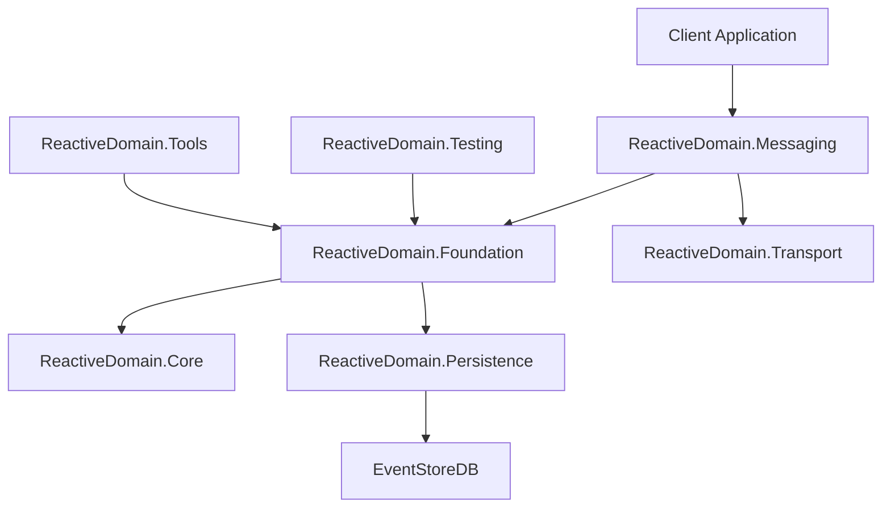

# Reactive Domain Documentation

Welcome to the comprehensive documentation for the Reactive Domain library, an open-source framework for implementing event sourcing in .NET projects using reactive programming principles.

> **Version Information**: This documentation corresponds to the [reactive-documentation](https://github.com/ReactiveDomain/reactive-domain/tree/reactive-documentation) branch, which was created from trunk commit [05e5268](https://github.com/ReactiveDomain/reactive-domain/commit/05e5268f0ceef1034885905402590486fcb6fcad) ("Removes .NET 6 support", 2025-02-18). If you notice differences between this documentation and your code, please check which version of Reactive Domain you're using.

## Introduction

Reactive Domain is built on several key design principles:

1. **Simplicity and Consistency**: The framework emphasizes a small number of consistent patterns and design principles in its public interfaces, making it easier for developers to learn and use.

2. **Developer Experience**: Ease of use and "design for code review" have been the driving forces behind the framework's evolution. The API is designed to be intuitive and self-documenting.

3. **Opinionated Design**: The framework makes opinionated choices about implementation details to provide a clear path for developers to follow.

4. **Pragmatic Trade-offs**: Where trade-offs have been necessary, the framework prioritizes developer experience and code clarity over performance optimizations.

## Key Features

- **Event Sourcing**: A complete implementation of event sourcing patterns, including aggregates, events, and repositories.
- **CQRS Support**: Tools for implementing Command Query Responsibility Segregation, including command handlers and projections.
- **EventStoreDB Integration**: Built-in support for storing and retrieving events using EventStoreDB.
- **Messaging Framework**: A comprehensive messaging system for handling commands, events, and queries.
- **Testing Utilities**: Tools for testing event-sourced applications, including in-memory event stores and test fixtures.
- **Correlation and Causation Tracking**: Built-in support for tracking correlation and causation IDs across message flows.
- **Snapshotting**: Support for creating and restoring from snapshots to improve performance.

## Learning Path

> **New to Reactive Domain?** Check out our [Complete Learning Path Guide](learning-path.md) for a structured approach to mastering event sourcing and CQRS with Reactive Domain.

For the best learning experience, we recommend following this progression:

1. **Start Here**: [Core Concepts](core-concepts.md) - Understand the fundamentals of event sourcing and CQRS
2. **Next**: [Usage Patterns](usage-patterns.md) - Learn how to apply these concepts in practice
3. **Then**: [Code Examples](code-examples/README.md) - See concrete implementations
   - Begin with [Creating a New Aggregate Root](code-examples/creating-aggregate-root.md)
   - Move on to [Handling Commands and Events](code-examples/handling-commands-events.md)
   - Explore real-world examples like our [Banking Domain Example](code-examples/banking-domain-example.md)
4. **Explore**: [API Reference](api-reference/README.md) - Dive into the details of specific components
5. **Advanced**: [Architecture Guide](architecture.md) - Understand the system architecture
6. **Production**: [Deployment Guide](deployment.md) and [Performance Optimization](performance.md) - Prepare for production

### Learning Resources

- **Books and Articles**
  - "Domain-Driven Design" by Eric Evans
  - "Implementing Domain-Driven Design" by Vaughn Vernon
  - [Martin Fowler on Event Sourcing](https://martinfowler.com/eaaDev/EventSourcing.html)
  - [CQRS Journey by Microsoft](https://docs.microsoft.com/en-us/previous-versions/msp-n-p/jj554200(v=pandp.10))

- **Community Resources**
  - [EventStoreDB Documentation](https://developers.eventstore.com/)
  - [DDD/CQRS Google Group](https://groups.google.com/g/dddcqrs)
  - [Stack Overflow - Event Sourcing Tag](https://stackoverflow.com/questions/tagged/event-sourcing)

## Navigation Resources

To help you navigate the documentation more effectively, we've created these resources:

- [Component Relationships](component-relationships.md) - Visual guide showing how different components work together
- [Navigation Index](navigation-index.md) - Comprehensive index of all documentation with cross-references
- [Quick Reference](#quick-reference) - Quick links to common tasks and key components

## Table of Contents

1. [Core Concepts](core-concepts.md)
   - Event Sourcing Fundamentals
   - Event Store Architecture
   - CQRS Implementation
   - Reactive Programming Principles
   - Domain-Driven Design Concepts
   - Event, Command, and Message Flow
   - Correlation and Causation Tracking

2. [Component Documentation](components/README.md)
   - [ReactiveDomain.Core](components/core.md)
   - ReactiveDomain.Foundation
   - ReactiveDomain.Messaging
   - ReactiveDomain.Persistence
   - ReactiveDomain.Transport
   - ReactiveDomain.Testing
   - ReactiveDomain.Policy
   - ReactiveDomain.IdentityStorage
   - ReactiveDomain.Tools

3. [Interface Documentation](interfaces/README.md)
   - [IEventSource](interfaces/event-source.md)
   - IRepository
   - ICorrelatedRepository
   - IListener
   - IMetadataSource
   - ISnapshotSource
   - IStreamStoreConnection
   - IEventSerializer
   - IMessage, ICommand, IEvent
   - ICorrelatedMessage, ICorrelatedEventSource

4. [Usage Patterns](usage-patterns.md)
   - Setting Up a New Reactive Domain Project
   - Creating and Working with Aggregates
   - Implementing Commands and Events
   - Setting Up Repositories and Event Stores
   - Implementing Projections and Read Models
   - Handling Concurrency and Versioning
   - Error Handling and Recovery Strategies
   - Testing Event-Sourced Systems
   - Performance Optimization Techniques
   - Integration with Other Systems and Frameworks

5. [Code Examples](code-examples/README.md)
   - Creating a New Aggregate Root
   - Handling Commands and Generating Events
   - Saving and Retrieving Aggregates
   - Setting Up Event Listeners
   - Implementing Projections
   - Handling Correlation and Causation
   - Implementing Snapshots
   - Testing Aggregates and Event Handlers
   - Integration with ASP.NET Core
   - Complete Sample Applications

6. [Troubleshooting Guide](troubleshooting.md)
   - Event Versioning and Schema Evolution
   - Handling Concurrency Conflicts
   - Debugging Event-Sourced Systems
   - Performance Issues and Optimization
   - Integration Challenges
   - Testing Strategies and Common Issues
   - Deployment Considerations

7. [API Reference](api-reference/README.md)
   - Type Signatures and Inheritance Hierarchies
   - Method Signatures and Parameters
   - Property Types and Accessibility
   - Event Patterns and Subscription Models
   - Extension Points and Customization Options
   - Deprecation Notices and Migration Paths

8. [Architecture Guide](architecture.md)
   - High-Level Architecture
   - Design Principles and Patterns
   - Component Interactions
   - Extension Points
   - Integration Patterns
   - Scaling and Performance Considerations
   - Security Considerations

9. [Migration Guide](migration.md)
   - Breaking Changes and Deprecations
   - New Features and Enhancements
   - Migration Strategies
   - Backward Compatibility Considerations
   - Testing Strategies for Migrations

10. [Glossary](glossary.md)
    - Event Sourcing Terminology
    - CQRS Terminology
    - Domain-Driven Design Terminology
    - Reactive Programming Terminology
    - Reactive Domain-Specific Terminology

11. [FAQ](faq.md)
    - When to Use Event Sourcing and CQRS
    - Performance Considerations and Optimizations
    - Scaling Event-Sourced Systems
    - Integration with Existing Systems
    - Testing Strategies and Best Practices
    - Common Pitfalls and How to Avoid Them
    - Comparison with Other Event Sourcing Frameworks

12. [Deployment Guide](deployment.md)
    - Development Environment Setup
    - Testing Environment Configuration
    - Production Deployment Considerations
    - Scaling Strategies
    - Monitoring and Observability
    - Backup and Recovery Strategies
    - Security Considerations

13. [Performance Optimization Guide](performance.md)
    - Event Store Performance Considerations
    - Snapshot Strategies
    - Read Model Optimization Techniques
    - Message Handling Performance
    - Scaling Strategies for High-Throughput Systems
    - Monitoring and Profiling Techniques
    - Benchmarking and Performance Testing

14. [Security Guide](security.md)
    - Authentication and Authorization
    - Data Protection and Privacy
    - Audit Logging and Compliance
    - Secure Deployment Practices
    - Threat Modeling
    - Security Testing Strategies

15. [Integration Guide](integration.md)
    - Integration with ASP.NET Core
    - Integration with Other .NET Frameworks
    - Integration with Non-.NET Systems
    - API Design for Event-Sourced Systems
    - Message Contracts and Versioning
    - Integration Testing Strategies

16. [Video Tutorial Script](video-tutorial-script.md)
    - Introduction to Reactive Domain
    - Setting Up Your First Project
    - Creating Aggregates and Events
    - Working with Repositories
    - Building Read Models
    - Testing Your Application

17. [Workshop Materials](workshop-materials.md)
    - Workshop Overview
    - Prerequisites
    - Exercises
    - Sample Solutions
    - Presentation Materials

## Quick Reference

| If you want to... | Go to... |
|-------------------|----------|
| Understand event sourcing | [Core Concepts](core-concepts.md) |
| Start a new project | [Usage Patterns](usage-patterns.md#setting-up-a-new-reactive-domain-project) |
| Create an aggregate | [Code Examples](code-examples/README.md#creating-a-new-aggregate-root) |
| Fix a common issue | [Troubleshooting Guide](troubleshooting.md) |
| Optimize performance | [Performance Optimization Guide](performance.md) |
| Secure your application | [Security Guide](security.md) |
| Deploy to production | [Deployment Guide](deployment.md) |
| Learn key terminology | [Glossary](glossary.md) |

### Key Types Reference

| Type | Description | Documentation |
|------|-------------|---------------|
| ReadModelBase | Base class for read models in CQRS architecture | [API Reference](api-reference/types/read-model-base.md) |
| MessageBuilder | Factory for creating correlated messages | [API Reference](api-reference/types/message-builder.md) |
| Command | Base class for command messages | [API Reference](api-reference/types/command.md) |
| Event | Base class for event messages | [API Reference](api-reference/types/event.md) |
| ICorrelatedMessage | Interface for messages with correlation tracking | [API Reference](api-reference/types/icorrelated-message.md) |
| AggregateRoot | Base class for domain aggregates | [API Reference](api-reference/types/aggregate-root.md) |
| IRepository | Interface for repositories | [API Reference](api-reference/types/irepository.md) |
| IEventSource | Core interface for event-sourced entities | [API Reference](api-reference/types/ievent-source.md) |

## Getting Started

If you're new to Reactive Domain, we recommend starting with the [Core Concepts](core-concepts.md) section to understand the fundamental principles behind event sourcing and how they're implemented in Reactive Domain.

For practical guidance, check out the [Usage Patterns](usage-patterns.md) and [Code Examples](code-examples/README.md) sections.

## Architecture Overview

Reactive Domain is organized into several key components:

## Contributing

Contributions to this documentation are welcome! Please see the [CONTRIBUTING.md](../CONTRIBUTING.md) file for guidelines.

---

**Next**: [Core Concepts](core-concepts.md)
