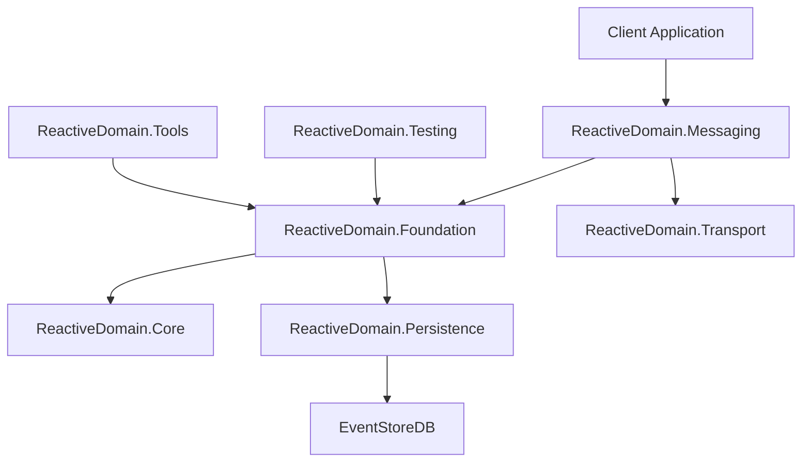
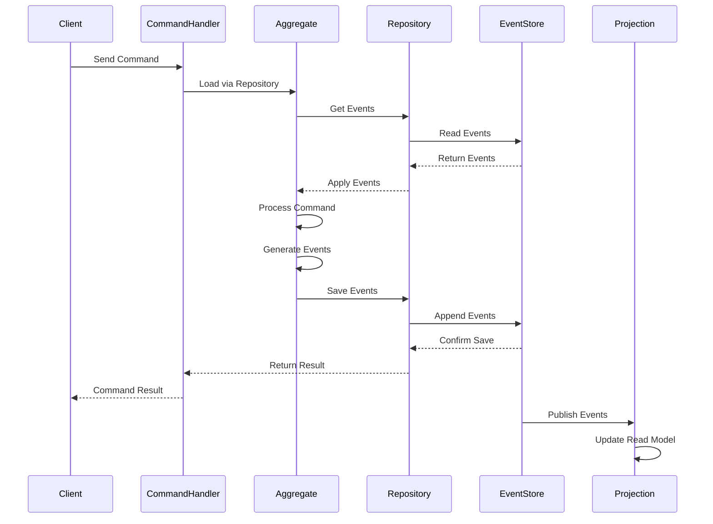

# Architecture Guide

[← Back to Table of Contents](README.md)

This guide provides a detailed overview of the Reactive Domain architecture, explaining how the various components work together to support event sourcing and CQRS in .NET applications.

## Table of Contents

- [High-Level Architecture](#high-level-architecture)
- [Design Principles and Patterns](#design-principles-and-patterns)
- [Component Interactions](#component-interactions)
- [Extension Points](#extension-points)
- [Integration Patterns](#integration-patterns)
- [Scaling and Performance Considerations](#scaling-and-performance-considerations)
- [Security Considerations](#security-considerations)

## High-Level Architecture

Reactive Domain is organized into several key components that work together to provide a complete event sourcing and CQRS solution. The following diagram illustrates the high-level architecture:



### Core Components

1. **ReactiveDomain.Core**
   - Contains the fundamental interfaces and base classes for event sourcing
   - Defines the `IEventSource` interface, which is the foundation of event-sourced entities
   - Provides base implementations for aggregates, events, and commands
   - Implements the core event sourcing patterns

2. **ReactiveDomain.Foundation**
   - Builds on Core to provide higher-level abstractions
   - Implements the `AggregateRoot` class, which is the base class for domain aggregates
   - Provides repository implementations for storing and retrieving aggregates
   - Implements correlation and causation tracking

3. **ReactiveDomain.Messaging**
   - Implements the messaging infrastructure for commands, events, and queries
   - Provides message routing and handling mechanisms
   - Implements the bus pattern for message distribution
   - Supports both synchronous and asynchronous message handling

4. **ReactiveDomain.Persistence**
   - Provides storage mechanisms for events and snapshots
   - Implements the EventStoreDB integration
   - Handles serialization and deserialization of events
   - Manages stream naming and event metadata

5. **ReactiveDomain.Transport**
   - Implements transport mechanisms for distributed messaging
   - Supports both in-process and cross-process communication
   - Provides reliable message delivery guarantees
   - Implements message routing across process boundaries

6. **ReactiveDomain.Testing**
   - Provides testing utilities for event-sourced applications
   - Implements in-memory event stores for testing
   - Provides test fixtures for aggregates and event handlers
   - Supports both unit and integration testing

7. **ReactiveDomain.Tools**
   - Provides utility tools for working with event-sourced systems
   - Implements event store exploration and management tools
   - Provides diagnostic utilities for troubleshooting
   - Supports development and operational workflows

### Data Flow

The following diagram illustrates the data flow in a typical Reactive Domain application:



## Design Principles and Patterns

Reactive Domain is built on several key design principles and patterns:

### 1. Event Sourcing

Event sourcing is the core pattern in Reactive Domain, where:

- The state of an entity is determined by a sequence of events
- Events are immutable and represent facts that have occurred
- The current state is derived by replaying events
- Events are stored in an append-only event store

Implementation in Reactive Domain:
- `IEventSource` interface defines the contract for event-sourced entities
- `AggregateRoot` provides a base implementation for domain aggregates
- Events are stored in EventStoreDB
- Repositories handle loading and saving aggregates

### 2. Command Query Responsibility Segregation (CQRS)

CQRS separates the command (write) and query (read) sides of an application:

- Commands modify state and generate events
- Queries read from optimized read models
- Read models are built by processing events

Implementation in Reactive Domain:
- Command handlers process commands and update aggregates
- Event handlers update read models
- Read models are optimized for specific query patterns
- Separate repositories for command and query sides

### 3. Domain-Driven Design (DDD)

Reactive Domain supports DDD principles:

- Aggregates encapsulate business rules and enforce invariants
- Entities have identity and lifecycle
- Value objects are immutable and have no identity
- Domain events represent significant state changes
- Repositories provide access to aggregates

Implementation in Reactive Domain:
- `AggregateRoot` supports DDD aggregates
- Events represent domain events
- Repositories provide aggregate persistence
- Value objects can be used as event properties

### 4. Messaging Patterns

Reactive Domain uses messaging patterns for communication:

- Commands represent intentions to change state
- Events represent state changes that have occurred
- Queries request information from read models
- Message handlers process messages and perform actions

Implementation in Reactive Domain:
- `IMessage`, `ICommand`, `IEvent` interfaces define message contracts
- Message buses route messages to handlers
- Message handlers process messages and perform actions
- Correlation and causation tracking links related messages

### 5. Reactive Programming

Reactive Domain embraces reactive programming principles:

- Asynchronous message processing
- Event-driven architecture
- Non-blocking operations
- Resilience and fault tolerance

Implementation in Reactive Domain:
- Asynchronous message handling
- Event-driven workflows
- Reactive streams for event processing
- Error handling and recovery mechanisms

## Component Interactions

### Command Processing Flow

1. **Command Creation**
   - A command is created, representing an intention to change state
   - Commands include a unique ID, correlation ID, and causation ID
   - Commands are validated before processing

2. **Command Routing**
   - Commands are routed to the appropriate command handler
   - Routing is based on command type
   - Command handlers are registered with the command bus

3. **Aggregate Loading**
   - The command handler loads the target aggregate from the repository
   - The repository reads events from the event store
   - Events are applied to the aggregate to reconstruct its state

4. **Command Handling**
   - The command is passed to the aggregate for processing
   - The aggregate validates the command against its current state
   - If valid, the aggregate generates one or more events
   - Events are applied to the aggregate to update its state

5. **Event Persistence**
   - The aggregate's events are saved to the event store
   - The repository handles optimistic concurrency control
   - Events are persisted atomically with the expected version

6. **Event Publication**
   - Events are published to event handlers
   - Event handlers update read models and trigger side effects
   - Event handlers can be synchronous or asynchronous

### Query Processing Flow

1. **Query Creation**
   - A query is created, representing a request for information
   - Queries include parameters to filter and shape the results

2. **Query Routing**
   - Queries are routed to the appropriate query handler
   - Routing is based on query type
   - Query handlers are registered with the query bus

3. **Read Model Access**
   - The query handler accesses the appropriate read model
   - Read models are optimized for specific query patterns
   - Read models can be in-memory, database tables, or other storage

4. **Result Generation**
   - The query handler processes the query against the read model
   - Results are filtered and shaped according to the query parameters
   - Results are returned to the caller

### Event Processing Flow

1. **Event Generation**
   - Events are generated by aggregates in response to commands
   - Events represent state changes that have occurred
   - Events include metadata such as correlation and causation IDs

2. **Event Persistence**
   - Events are persisted to the event store
   - Events are stored in streams, typically one stream per aggregate
   - Events include metadata for tracing and debugging

3. **Event Publication**
   - Events are published to event handlers
   - Event handlers can be synchronous or asynchronous
   - Event handlers can update read models, trigger side effects, or start processes

4. **Read Model Updates**
   - Event handlers update read models based on event data
   - Read models are optimized for specific query patterns
   - Read models can be in-memory, database tables, or other storage

## Extension Points

Reactive Domain provides several extension points for customization:

### 1. Custom Aggregates

Create custom aggregates by extending `AggregateRoot`:

```csharp
public class Account : AggregateRoot
{
    private decimal _balance;
    
    public Account(Guid id) : base(id)
    {
    }
    
    public void Deposit(decimal amount)
    {
        if (amount <= 0)
            throw new ArgumentException("Amount must be positive", nameof(amount));
            
        RaiseEvent(new AmountDeposited(Id, amount));
    }
    
    public void Withdraw(decimal amount)
    {
        if (amount <= 0)
            throw new ArgumentException("Amount must be positive", nameof(amount));
            
        if (_balance < amount)
            throw new InvalidOperationException("Insufficient funds");
            
        RaiseEvent(new AmountWithdrawn(Id, amount));
    }
    
    private void Apply(AmountDeposited @event)
    {
        _balance += @event.Amount;
    }
    
    private void Apply(AmountWithdrawn @event)
    {
        _balance -= @event.Amount;
    }
}
```

### 2. Custom Event Serialization

Implement custom event serialization by implementing `IEventSerializer`:

```csharp
public class CustomEventSerializer : IEventSerializer
{
    public object Deserialize(RecordedEvent recordedEvent)
    {
        // Custom deserialization logic
        var eventType = Type.GetType(recordedEvent.EventType);
        var eventData = Encoding.UTF8.GetString(recordedEvent.Data);
        return JsonConvert.DeserializeObject(eventData, eventType);
    }
    
    public IEventData Serialize(object @event, Guid eventId)
    {
        // Custom serialization logic
        var eventType = @event.GetType().AssemblyQualifiedName;
        var eventData = Encoding.UTF8.GetBytes(JsonConvert.SerializeObject(@event));
        var metadata = Encoding.UTF8.GetBytes(JsonConvert.SerializeObject(new { EventType = eventType }));
        
        return new EventData(eventId, eventType, true, eventData, metadata);
    }
}
```

### 3. Custom Stream Naming

Implement custom stream naming by implementing `IStreamNameBuilder`:

```csharp
public class CustomStreamNameBuilder : IStreamNameBuilder
{
    public string GenerateForAggregate(Type aggregateType, Guid aggregateId)
    {
        // Custom stream naming logic
        return $"custom-{aggregateType.Name.ToLower()}-{aggregateId}";
    }
}
```

### 4. Custom Message Handling

Implement custom message handling by implementing `ICommandHandler`, `IEventHandler`, or `IQueryHandler`:

```csharp
public class CustomCommandHandler : ICommandHandler<CreateAccount>
{
    private readonly IRepository _repository;
    
    public CustomCommandHandler(IRepository repository)
    {
        _repository = repository;
    }
    
    public void Handle(CreateAccount command)
    {
        // Custom command handling logic
        var account = new Account(command.AccountId);
        account.Initialize(command.InitialBalance);
        _repository.Save(account);
    }
}
```

### 5. Custom Event Store Integration

Implement custom event store integration by implementing `IStreamStoreConnection`:

```csharp
public class CustomStreamStoreConnection : IStreamStoreConnection
{
    public void Connect()
    {
        // Custom connection logic
    }
    
    public void Disconnect()
    {
        // Custom disconnection logic
    }
    
    public IStreamSlice ReadStreamForward(string streamName, long start, int count)
    {
        // Custom stream reading logic
        return new StreamSlice(/* ... */);
    }
    
    public void AppendToStream(string streamName, long expectedVersion, IEnumerable<IEventData> events)
    {
        // Custom stream appending logic
    }
    
    // Implement other methods
}
```

### 6. Custom Snapshots

Implement custom snapshots by implementing `ISnapshotSource`:

```csharp
public class Account : AggregateRoot, ISnapshotSource
{
    private decimal _balance;
    
    // ... existing code ...
    
    public void RestoreFromSnapshot(object snapshot)
    {
        var accountSnapshot = (AccountSnapshot)snapshot;
        _balance = accountSnapshot.Balance;
        ExpectedVersion = accountSnapshot.Version;
    }
    
    public object TakeSnapshot()
    {
        return new AccountSnapshot
        {
            Balance = _balance,
            Version = ExpectedVersion
        };
    }
}

public class AccountSnapshot
{
    public decimal Balance { get; set; }
    public long Version { get; set; }
}
```

## Integration Patterns

Reactive Domain supports several integration patterns for working with external systems:

### 1. Event-Driven Integration

Use events to integrate with external systems:

```csharp
public class ExternalSystemIntegration : IEventHandler<AccountCreated>, IEventHandler<AmountDeposited>
{
    private readonly IExternalSystem _externalSystem;
    
    public ExternalSystemIntegration(IExternalSystem externalSystem)
    {
        _externalSystem = externalSystem;
    }
    
    public void Handle(AccountCreated @event)
    {
        _externalSystem.CreateAccount(@event.AccountId, @event.Owner);
    }
    
    public void Handle(AmountDeposited @event)
    {
        _externalSystem.RecordDeposit(@event.AccountId, @event.Amount);
    }
}
```

### 2. Command-Driven Integration

Use commands to integrate with external systems:

```csharp
public class ExternalSystemCommandHandler : ICommandHandler<CreateExternalAccount>
{
    private readonly IRepository _repository;
    private readonly IExternalSystem _externalSystem;
    
    public ExternalSystemCommandHandler(IRepository repository, IExternalSystem externalSystem)
    {
        _repository = repository;
        _externalSystem = externalSystem;
    }
    
    public void Handle(CreateExternalAccount command)
    {
        // Create account in local system
        var account = new Account(command.AccountId);
        account.Initialize(command.InitialBalance);
        _repository.Save(account);
        
        // Create account in external system
        _externalSystem.CreateAccount(command.AccountId, command.Owner);
    }
}
```

### 3. Saga Pattern

Use sagas to coordinate complex workflows involving multiple aggregates and external systems:

```csharp
public class AccountTransferSaga : 
    IEventHandler<TransferInitiated>,
    IEventHandler<SourceAccountDebited>,
    IEventHandler<DestinationAccountCredited>,
    IEventHandler<TransferFailed>
{
    private readonly IRepository _repository;
    private readonly ICommandBus _commandBus;
    
    public AccountTransferSaga(IRepository repository, ICommandBus commandBus)
    {
        _repository = repository;
        _commandBus = commandBus;
    }
    
    public void Handle(TransferInitiated @event)
    {
        _commandBus.Send(new DebitSourceAccount(
            @event.TransferId,
            @event.SourceAccountId,
            @event.Amount));
    }
    
    public void Handle(SourceAccountDebited @event)
    {
        _commandBus.Send(new CreditDestinationAccount(
            @event.TransferId,
            @event.DestinationAccountId,
            @event.Amount));
    }
    
    public void Handle(DestinationAccountCredited @event)
    {
        _commandBus.Send(new CompleteTransfer(@event.TransferId));
    }
    
    public void Handle(TransferFailed @event)
    {
        if (@event.Stage == TransferStage.Debit)
        {
            // No compensation needed, transfer failed before any changes
            _commandBus.Send(new CancelTransfer(@event.TransferId, @event.Reason));
        }
        else if (@event.Stage == TransferStage.Credit)
        {
            // Compensate by crediting the source account
            _commandBus.Send(new RefundSourceAccount(
                @event.TransferId,
                @event.SourceAccountId,
                @event.Amount));
        }
    }
}
```

### 4. Outbox Pattern

Use the outbox pattern to ensure reliable integration with external systems:

```csharp
public class OutboxRepository : IRepository
{
    private readonly IRepository _innerRepository;
    private readonly IOutboxStore _outboxStore;
    
    public OutboxRepository(IRepository innerRepository, IOutboxStore outboxStore)
    {
        _innerRepository = innerRepository;
        _outboxStore = outboxStore;
    }
    
    public void Save(IEventSource aggregate)
    {
        using (var transaction = new TransactionScope())
        {
            _innerRepository.Save(aggregate);
            
            // Store integration events in the outbox
            foreach (var @event in aggregate.TakeEvents())
            {
                _outboxStore.Add(new OutboxMessage
                {
                    Id = Guid.NewGuid(),
                    AggregateId = aggregate.Id,
                    AggregateType = aggregate.GetType().Name,
                    EventType = @event.GetType().Name,
                    EventData = JsonConvert.SerializeObject(@event),
                    CreatedAt = DateTime.UtcNow
                });
            }
            
            transaction.Complete();
        }
    }
    
    // Implement other methods
}

public class OutboxProcessor
{
    private readonly IOutboxStore _outboxStore;
    private readonly IExternalSystem _externalSystem;
    
    public OutboxProcessor(IOutboxStore outboxStore, IExternalSystem externalSystem)
    {
        _outboxStore = outboxStore;
        _externalSystem = externalSystem;
    }
    
    public void ProcessOutbox()
    {
        var messages = _outboxStore.GetPendingMessages();
        
        foreach (var message in messages)
        {
            try
            {
                var @event = JsonConvert.DeserializeObject(message.EventData, Type.GetType(message.EventType));
                
                // Process the event for integration
                if (@event is AccountCreated accountCreated)
                {
                    _externalSystem.CreateAccount(accountCreated.AccountId, accountCreated.Owner);
                }
                else if (@event is AmountDeposited amountDeposited)
                {
                    _externalSystem.RecordDeposit(amountDeposited.AccountId, amountDeposited.Amount);
                }
                
                // Mark as processed
                _outboxStore.MarkAsProcessed(message.Id);
            }
            catch (Exception ex)
            {
                // Log error and retry later
                _outboxStore.MarkAsFailed(message.Id, ex.Message);
            }
        }
    }
}
```

## Scaling and Performance Considerations

### 1. Event Store Scaling

EventStoreDB can be scaled in several ways:

- **Single Node**: Suitable for development and small production workloads
- **Cluster**: Multiple nodes for high availability and throughput
- **Projections**: Offload read model building to EventStoreDB projections
- **Subscriptions**: Use persistent subscriptions for reliable event processing

Recommendations:
- Use a cluster configuration in production
- Configure appropriate hardware for the event store
- Monitor event store performance and adjust resources as needed
- Use snapshots for large aggregates to improve loading performance

### 2. Read Model Scaling

Read models can be scaled independently:

- **Database Scaling**: Scale the database hosting read models
- **Caching**: Use caching to reduce database load
- **Sharding**: Shard read models for high-volume data
- **Eventual Consistency**: Accept eventual consistency for better scalability

Recommendations:
- Choose the right database for each read model
- Scale read models independently based on query patterns
- Use caching for frequently accessed data
- Consider eventual consistency trade-offs

### 3. Command Processing Scaling

Command processing can be scaled in several ways:

- **Horizontal Scaling**: Deploy multiple command processors
- **Load Balancing**: Distribute commands across processors
- **Command Queuing**: Queue commands for asynchronous processing
- **Command Batching**: Batch related commands for efficiency

Recommendations:
- Scale command processors based on throughput requirements
- Use load balancing for high-volume command processing
- Consider command queuing for peak load handling
- Batch related commands where appropriate

### 4. Event Processing Scaling

Event processing can be scaled in several ways:

- **Parallel Processing**: Process events in parallel
- **Competing Consumers**: Use competing consumers for event processing
- **Event Partitioning**: Partition events for parallel processing
- **Backpressure**: Implement backpressure for overload protection

Recommendations:
- Scale event processors based on event volume
- Use competing consumers for high-volume event processing
- Partition events by aggregate type or other criteria
- Implement backpressure mechanisms for overload protection

### 5. Performance Optimization Techniques

Several techniques can improve performance:

- **Snapshots**: Use snapshots to reduce event loading time
- **Caching**: Cache aggregates and read models
- **Batching**: Batch operations for efficiency
- **Asynchronous Processing**: Use asynchronous processing for non-critical operations
- **Read Model Optimization**: Optimize read models for specific query patterns

Recommendations:
- Use snapshots for aggregates with many events
- Implement caching for frequently accessed data
- Batch operations where appropriate
- Use asynchronous processing for non-critical operations
- Optimize read models for specific query patterns

## Security Considerations

### 1. Authentication and Authorization

- **Command Authorization**: Authorize commands before processing
- **Query Authorization**: Authorize queries before processing
- **Event Authorization**: Control access to events
- **Role-Based Access Control**: Implement RBAC for command and query authorization

Implementation:
```csharp
public class AuthorizedCommandBus : ICommandBus
{
    private readonly ICommandBus _innerBus;
    private readonly IAuthorizationService _authorizationService;
    private readonly IUserContext _userContext;
    
    public AuthorizedCommandBus(
        ICommandBus innerBus,
        IAuthorizationService authorizationService,
        IUserContext userContext)
    {
        _innerBus = innerBus;
        _authorizationService = authorizationService;
        _userContext = userContext;
    }
    
    public void Send<TCommand>(TCommand command) where TCommand : class, ICommand
    {
        // Authorize the command
        if (!_authorizationService.IsAuthorized(_userContext.CurrentUser, command))
        {
            throw new UnauthorizedAccessException($"User is not authorized to execute {typeof(TCommand).Name}");
        }
        
        // Forward to inner bus
        _innerBus.Send(command);
    }
}
```

### 2. Data Protection

- **Event Data Encryption**: Encrypt sensitive event data
- **Metadata Protection**: Protect sensitive metadata
- **Secure Storage**: Secure event store and read model storage
- **Data Masking**: Mask sensitive data in logs and diagnostics

Implementation:
```csharp
public class EncryptingEventSerializer : IEventSerializer
{
    private readonly IEventSerializer _innerSerializer;
    private readonly IEncryptionService _encryptionService;
    
    public EncryptingEventSerializer(
        IEventSerializer innerSerializer,
        IEncryptionService encryptionService)
    {
        _innerSerializer = innerSerializer;
        _encryptionService = encryptionService;
    }
    
    public object Deserialize(RecordedEvent recordedEvent)
    {
        // Decrypt event data if necessary
        if (ShouldEncrypt(recordedEvent.EventType))
        {
            var decryptedData = _encryptionService.Decrypt(recordedEvent.Data);
            var decryptedEvent = new RecordedEvent(
                recordedEvent.EventStreamId,
                recordedEvent.EventNumber,
                recordedEvent.EventId,
                recordedEvent.EventType,
                decryptedData,
                recordedEvent.Metadata,
                recordedEvent.IsJson,
                recordedEvent.Created);
                
            return _innerSerializer.Deserialize(decryptedEvent);
        }
        
        return _innerSerializer.Deserialize(recordedEvent);
    }
    
    public IEventData Serialize(object @event, Guid eventId)
    {
        var eventData = _innerSerializer.Serialize(@event, eventId);
        
        // Encrypt event data if necessary
        if (ShouldEncrypt(@event.GetType().Name))
        {
            var encryptedData = _encryptionService.Encrypt(eventData.Data);
            return new EventData(
                eventData.EventId,
                eventData.Type,
                eventData.IsJson,
                encryptedData,
                eventData.Metadata);
        }
        
        return eventData;
    }
    
    private bool ShouldEncrypt(string eventType)
    {
        // Determine if the event type should be encrypted
        return eventType.Contains("Sensitive") || eventType.Contains("Personal");
    }
}
```

### 3. Audit Logging

- **Command Logging**: Log all commands with user context
- **Event Logging**: Log all events with correlation and causation
- **Access Logging**: Log all access to the system
- **Compliance Logging**: Log compliance-related activities

Implementation:
```csharp
public class AuditingCommandBus : ICommandBus
{
    private readonly ICommandBus _innerBus;
    private readonly IAuditLogger _auditLogger;
    private readonly IUserContext _userContext;
    
    public AuditingCommandBus(
        ICommandBus innerBus,
        IAuditLogger auditLogger,
        IUserContext userContext)
    {
        _innerBus = innerBus;
        _auditLogger = auditLogger;
        _userContext = userContext;
    }
    
    public void Send<TCommand>(TCommand command) where TCommand : class, ICommand
    {
        // Log the command for audit purposes
        _auditLogger.LogCommand(
            command.GetType().Name,
            JsonConvert.SerializeObject(command),
            _userContext.CurrentUser.Id,
            DateTime.UtcNow);
        
        // Forward to inner bus
        _innerBus.Send(command);
    }
}
```

### 4. Secure Deployment

- **Secure Configuration**: Protect configuration settings
- **Secret Management**: Use secure secret management
- **Network Security**: Secure network communication
- **Infrastructure Security**: Secure the infrastructure

Recommendations:
- Use secure configuration management
- Store secrets in a secure vault
- Encrypt network communication
- Implement infrastructure security best practices

### 5. Threat Modeling

- **Identify Assets**: Identify valuable assets in the system
- **Identify Threats**: Identify potential threats to those assets
- **Assess Risks**: Assess the risks of each threat
- **Mitigate Risks**: Implement controls to mitigate risks

Recommendations:
- Conduct regular threat modeling exercises
- Update threat models as the system evolves
- Implement controls based on risk assessment
- Test controls for effectiveness

---

**Navigation**:
- [← Previous: API Reference](api-reference/README.md)
- [↑ Back to Top](#architecture-guide)
- [→ Next: Migration Guide](migration.md)
