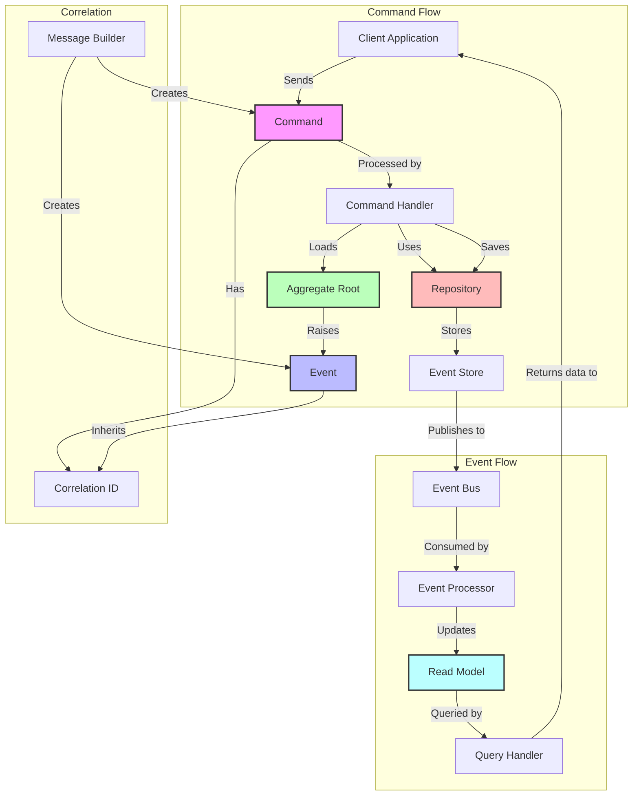
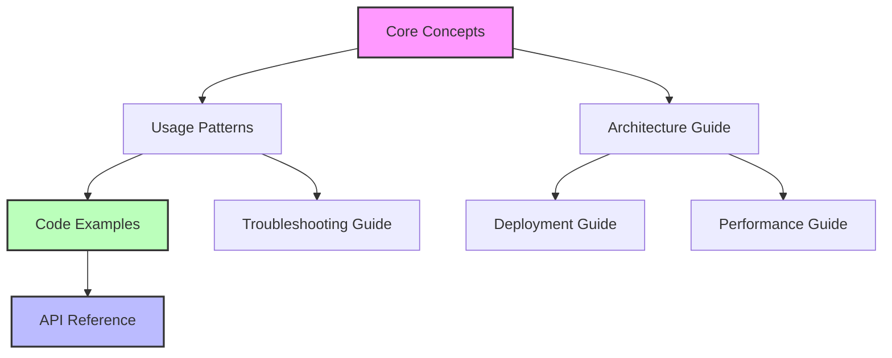

# Component Relationships in Reactive Domain

This document provides a visual guide to how different components in Reactive Domain relate to each other, helping you navigate the documentation more effectively.

## Core Component Relationships



## Key Interface Relationships

```mermaid
graph TD
    IEventSource[IEventSource] <|-- AggregateRoot[AggregateRoot]
    ICorrelatedMessage[ICorrelatedMessage] <|-- Command[Command]
    ICorrelatedMessage <|-- Event[Event]
    IRepository[IRepository] <|-- StreamStoreRepository[StreamStoreRepository]
    ICorrelatedRepository[ICorrelatedRepository] <|-- CorrelatedStreamStoreRepository[CorrelatedStreamStoreRepository]
    ICorrelatedRepository --|extends|> IRepository
    IEventBus[IEventBus] <|-- EventBus[EventBus]
    ICommandBus[ICommandBus] <|-- CommandBus[CommandBus]
    IEventProcessor[IEventProcessor] <|-- EventProcessor[EventProcessor]
    ICheckpointStore[ICheckpointStore] <|-- CheckpointStore[CheckpointStore]
    
    style IEventSource fill:#f9f,stroke:#333,stroke-width:2px
    style ICorrelatedMessage fill:#bbf,stroke:#333,stroke-width:2px
    style IRepository fill:#bfb,stroke:#333,stroke-width:2px
    style ICorrelatedRepository fill:#fbb,stroke:#333,stroke-width:2px
```

## Documentation Map

The following diagram shows how different documentation sections relate to each other:



## Component Documentation Quick Links

| Component | Description | Documentation | Related Components |
|-----------|-------------|---------------|-------------------|
| AggregateRoot | Base class for domain aggregates | [API Reference](api-reference/types/aggregate-root.md) | [IEventSource](api-reference/types/ievent-source.md), [EventRecorder](api-reference/types/event-recorder.md) |
| Command | Base class for command messages | [API Reference](api-reference/types/command.md) | [ICommand](api-reference/types/icommand.md), [ICommandHandler](api-reference/types/icommand-handler.md), [ICommandBus](api-reference/types/icommand-bus.md) |
| Event | Base class for event messages | [API Reference](api-reference/types/event.md) | [IEvent](api-reference/types/ievent.md), [IEventHandler](api-reference/types/ievent-handler.md), [IEventBus](api-reference/types/ievent-bus.md) |
| MessageBuilder | Factory for creating correlated messages | [API Reference](api-reference/types/message-builder.md) | [ICorrelatedMessage](api-reference/types/icorrelated-message.md) |
| Repository | Storage for aggregates | [API Reference](api-reference/types/irepository.md) | [ICorrelatedRepository](api-reference/types/icorrelated-repository.md), [StreamStoreRepository](api-reference/types/stream-store-repository.md) |
| EventProcessor | Processes events from the event store | [API Reference](api-reference/types/ievent-processor.md) | [ICheckpointStore](api-reference/types/icheckpoint-store.md), [IEventBus](api-reference/types/ievent-bus.md) |
| ReadModelBase | Base class for read models | [API Reference](api-reference/types/read-model-base.md) | [IReadModelRepository](api-reference/types/iread-model-repository.md) |
| ProcessManager | Coordinates complex business processes | [API Reference](api-reference/types/process-manager.md) | [ICommandBus](api-reference/types/icommand-bus.md), [IEventBus](api-reference/types/ievent-bus.md) |

## Learning Path Navigation

If you're new to Reactive Domain, follow this recommended learning path:

1. **Start Here**: [Core Concepts](core-concepts.md)
2. **Next**: [Usage Patterns](usage-patterns.md)
3. **Then**: [Code Examples](code-examples/README.md)
4. **Explore**: [API Reference](api-reference/README.md)
5. **Advanced**: [Architecture Guide](architecture.md)
6. **Production**: [Deployment Guide](deployment.md) and [Performance Optimization](performance.md)

## Common Tasks Navigation

| If you want to... | Go to... |
|-------------------|----------|
| Understand event sourcing | [Core Concepts](core-concepts.md) |
| Start a new project | [Usage Patterns](usage-patterns.md#setting-up-a-new-reactive-domain-project) |
| Create an aggregate | [Code Examples](code-examples/creating-aggregate-root.md) |
| Implement commands and events | [Code Examples](code-examples/handling-commands-events.md) |
| Set up repositories | [Code Examples](code-examples/saving-retrieving-aggregates.md) |
| Create read models | [Code Examples](code-examples/implementing-projections.md) |
| Implement correlation | [Code Examples](code-examples/correlation-causation.md) |
| Test your application | [Code Examples](code-examples/testing.md) |
| Fix a common issue | [Troubleshooting Guide](troubleshooting.md) |
| Optimize performance | [Performance Optimization Guide](performance.md) |
| Deploy to production | [Deployment Guide](deployment.md) |
