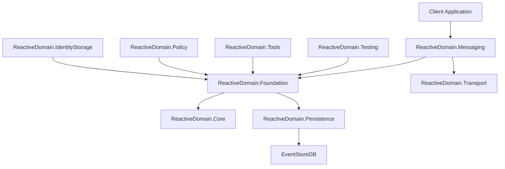

# Reactive Domain Components

[← Back to Table of Contents](../README.md)

This section provides detailed documentation for each of the major components of the Reactive Domain library.

## Component Navigation

Navigate through the components in logical order:

1. [ReactiveDomain.Core](core.md) → 
2. [ReactiveDomain.Foundation](foundation.md) → 
3. [ReactiveDomain.Messaging](messaging.md) → 
4. [ReactiveDomain.Persistence](persistence.md) → 
5. [ReactiveDomain.Transport](transport.md) → 
6. [ReactiveDomain.Testing](testing.md) → 
7. [ReactiveDomain.Policy](policy.md) → 
8. [ReactiveDomain.IdentityStorage](identity-storage.md) → 
9. [ReactiveDomain.Tools](tools.md)

## Table of Contents

1. [ReactiveDomain.Core](core.md) - Fundamental interfaces and abstractions
2. [ReactiveDomain.Foundation](foundation.md) - Domain implementation including aggregates and repositories
3. [ReactiveDomain.Messaging](messaging.md) - Messaging framework for commands, events, and queries
4. [ReactiveDomain.Persistence](persistence.md) - Event storage mechanisms
5. [ReactiveDomain.Transport](transport.md) - Transport layer for messages
6. [ReactiveDomain.Testing](testing.md) - Testing utilities for event-sourced systems
7. [ReactiveDomain.Policy](policy.md) - Policy implementation and enforcement
8. [ReactiveDomain.IdentityStorage](identity-storage.md) - Identity storage mechanisms
9. [ReactiveDomain.Tools](tools.md) - Developer tools and utilities

Each component documentation includes:

- Purpose and responsibility of the component
- Key interfaces and classes
- Implementation details
- Usage examples
- Integration with other components

## Component Relationships

The components in Reactive Domain are designed to work together to provide a complete event sourcing and CQRS framework. The following diagram shows the relationships between the components:

## Navigation Resources

For easier navigation through the component documentation, use these resources:

- [Component Relationships](../component-relationships.md) - Visual guide showing how different components work together
- [Navigation Index](../navigation-index.md) - Comprehensive index of all documentation with cross-references
- [API Reference](../api-reference/README.md) - Detailed API documentation for all components

---

**Navigation**:
- [← Previous: Core Concepts](../core-concepts.md)
- [↑ Back to Top](#reactive-domain-components)
- [→ Next: ReactiveDomain.Core](core.md)
