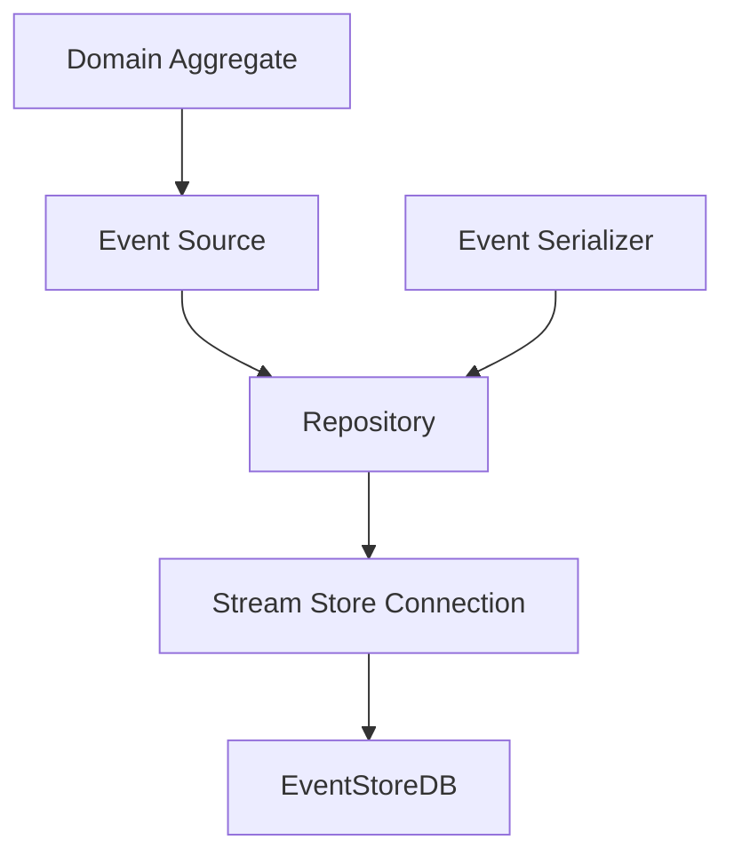
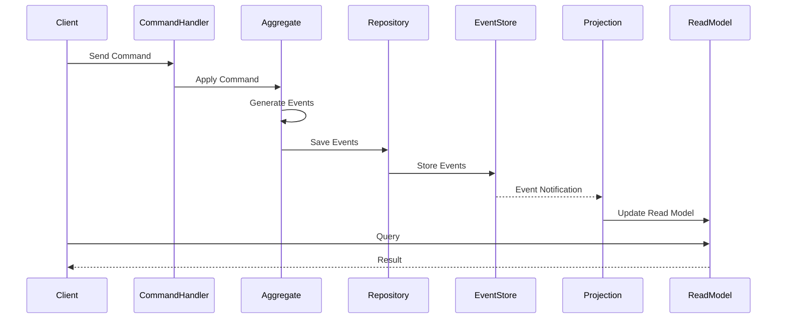
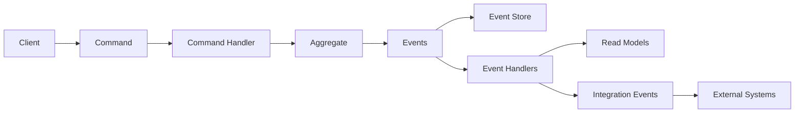

# Core Concepts of Reactive Domain

[← Back to Table of Contents](README.md)

This document explains the fundamental concepts of event sourcing as implemented in the Reactive Domain library.

## Table of Contents

- [Event Sourcing Fundamentals](#event-sourcing-fundamentals)
- [Event Store Architecture](#event-store-architecture)
- [CQRS Implementation](#cqrs-implementation)
- [Reactive Programming Principles](#reactive-programming-principles)
- [Domain-Driven Design Concepts](#domain-driven-design-concepts)
- [Event, Command, and Message Flow](#event-command-and-message-flow)
- [Correlation and Causation Tracking](#correlation-and-causation-tracking)
- [Snapshots](#snapshots)
- [Conclusion](#conclusion)

## Event Sourcing Fundamentals

### What is Event Sourcing?

Event sourcing is a design pattern where changes to the application state are captured as a sequence of immutable events. Instead of storing the current state of an entity, event sourcing stores the history of events that led to that state. The current state can be reconstructed by replaying these events.

In Reactive Domain, event sourcing is implemented through the following key components:

- **Events**: Immutable records of something that happened in the system
- **Aggregates**: Domain entities that encapsulate state and behavior
- **Event Store**: A specialized database for storing and retrieving events
- **Projections**: Components that transform events into queryable state

### Benefits of Event Sourcing

- **Complete Audit Trail**: Every change to the system is recorded as an event
- **Temporal Queries**: The ability to determine the state of the system at any point in time
- **Event Replay**: The ability to replay events to reconstruct state or to create new projections
- **Separation of Concerns**: Clear separation between write and read operations

## Event Store Architecture

Reactive Domain integrates with [EventStoreDB](https://eventstore.com), a purpose-built database for event sourcing. The integration is handled through the `ReactiveDomain.Persistence` namespace, which provides:

- **StreamStoreRepository**: A repository implementation that stores and retrieves events from EventStoreDB
- **StreamNameBuilder**: Utilities for generating consistent stream names
- **EventSerializer**: Components for serializing and deserializing events



## CQRS Implementation

Command Query Responsibility Segregation (CQRS) is a pattern that separates read and write operations. In Reactive Domain, CQRS is implemented through:

- **Commands**: Requests for the system to perform an action
- **Command Handlers**: Components that process commands and generate events
- **Events**: Records of changes that have occurred
- **Projections**: Components that transform events into queryable state
- **Queries**: Requests for information from the system
- **Query Handlers**: Components that process queries and return results



## Reactive Programming Principles

Reactive Domain incorporates reactive programming principles to handle event flows and asynchronous operations:

- **Event-Driven**: The system is driven by events that flow through components
- **Asynchronous**: Operations are performed asynchronously to improve scalability
- **Non-Blocking**: Components are designed to be non-blocking to maximize throughput
- **Message-Based**: Communication between components is done through messages

## Domain-Driven Design Concepts

Reactive Domain is built on Domain-Driven Design (DDD) principles:

- **Aggregates**: Clusters of domain objects treated as a single unit
- **Entities**: Objects with a distinct identity that persists over time
- **Value Objects**: Objects without identity that represent descriptive aspects of the domain
- **Repositories**: Components that provide access to aggregates
- **Domain Events**: Events that represent something significant that happened in the domain
- **Bounded Contexts**: Explicit boundaries within which a particular domain model applies

## Event, Command, and Message Flow

In Reactive Domain, messages flow through the system in a structured way:



- **Commands** are sent to command handlers
- **Command Handlers** load and update aggregates
- **Aggregates** generate events
- **Events** are stored in the event store and published to event handlers
- **Event Handlers** update read models and generate integration events
- **Integration Events** are sent to external systems

## Correlation and Causation Tracking

Reactive Domain provides built-in support for tracking correlation and causation IDs across message flows:

- **Correlation ID**: Identifies a business transaction that spans multiple messages
- **Causation ID**: Identifies the message that caused the current message

This is implemented through the `ICorrelatedMessage` interface and related components:

```csharp
public interface ICorrelatedMessage
{
    Guid MsgId { get; }
    Guid CorrelationId { get; }
    Guid CausationId { get; }
}
```

The `CorrelatedStreamStoreRepository` ensures that correlation and causation IDs are properly propagated when loading and saving aggregates.

## Snapshots

For performance optimization, Reactive Domain supports snapshots:

- **Snapshots**: Point-in-time captures of aggregate state
- **Snapshot Storage**: Mechanisms for storing and retrieving snapshots
- **Snapshot Strategies**: Policies for when to create snapshots

This is implemented through the `ISnapshotSource` interface:

```csharp
public interface ISnapshotSource
{
    void RestoreFromSnapshot(object snapshot);
    object TakeSnapshot();
}
```

## Conclusion

These core concepts form the foundation of the Reactive Domain library. Understanding these concepts is essential for effectively using the library to build event-sourced applications.

For more detailed information on specific components, see the [Component Documentation](components/README.md) section. For practical guidance on using these concepts, see the [Usage Patterns](usage-patterns.md) section.

[↑ Back to Top](#core-concepts-of-reactive-domain) | [← Back to Table of Contents](README.md)
