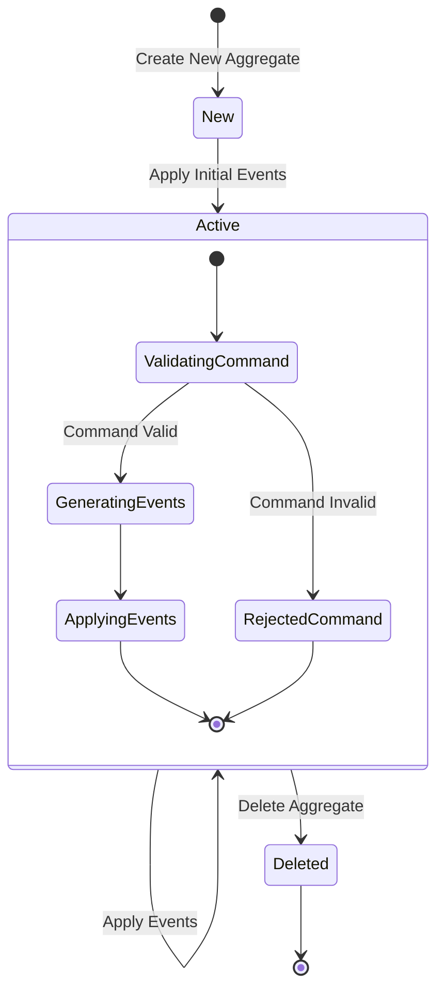
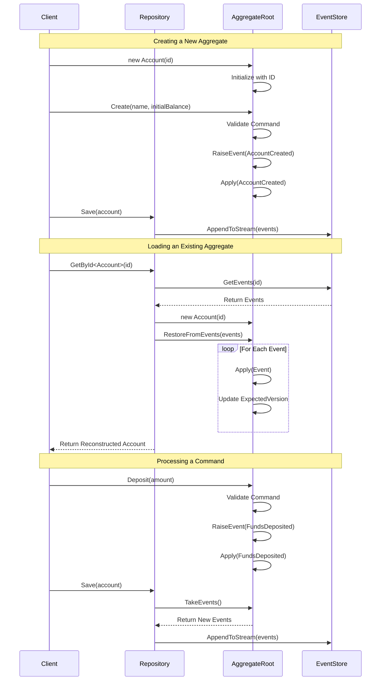
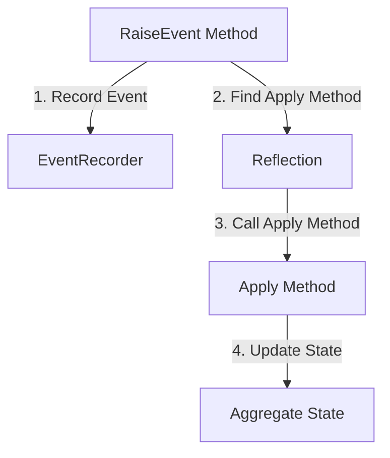
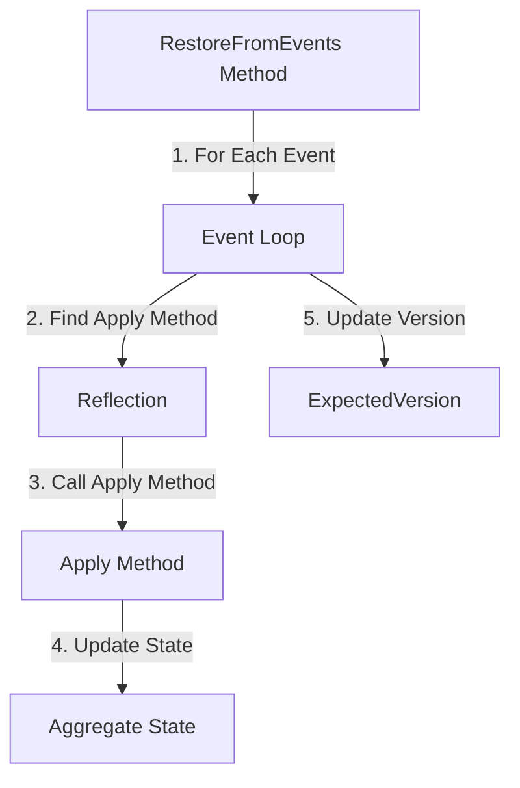
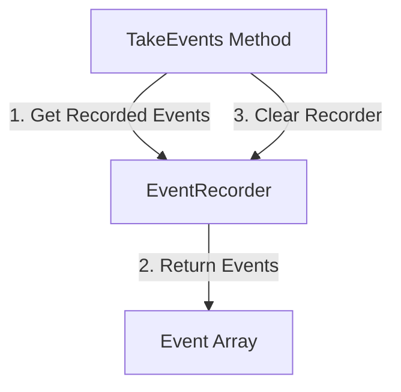

# AggregateRoot Lifecycle Diagram

This diagram illustrates the lifecycle of an `AggregateRoot` in Reactive Domain, showing how commands are processed and events are applied.

## Aggregate Lifecycle Overview



## Detailed Aggregate Processing Flow



## Key Methods in AggregateRoot

### RaiseEvent



### RestoreFromEvents



### TakeEvents



## Implementation Example

```csharp
public class Account : AggregateRoot
{
    private decimal _balance;
    private bool _isClosed;
    
    // Constructor for new aggregate
    public Account(Guid id) : base(id)
    {
        // Initialize with default state
    }
    
    // Constructor for loading from history
    protected Account(Guid id, IEnumerable<object> events) : base(id, events)
    {
        // Base constructor will call RestoreFromEvents
    }
    
    // Command method
    public void Deposit(decimal amount)
    {
        // Validate command
        if (_isClosed)
            throw new InvalidOperationException("Account is closed");
            
        if (amount <= 0)
            throw new ArgumentException("Amount must be positive");
            
        // Generate and apply event
        RaiseEvent(new FundsDeposited(Id, amount));
    }
    
    // Event handler
    private void Apply(FundsDeposited @event)
    {
        // Update state
        _balance += @event.Amount;
    }
}
```

## Key Concepts Illustrated

### Aggregate Identity and State

- Each aggregate has a unique identifier (`Id`)
- State is maintained through private fields (`_balance`, `_isClosed`)
- State is only modified through event application

### Command Processing

1. Commands are validated against current state
2. If valid, events are generated using `RaiseEvent`
3. Events are applied to update the aggregate state
4. New events are collected for storage

### Event Sourcing

- Events are the source of truth for aggregate state
- State is reconstructed by replaying events
- `ExpectedVersion` tracks the version for optimistic concurrency

### Invariant Protection

- Business rules are enforced in command methods
- Events are only generated if commands are valid
- State consistency is maintained through careful validation
