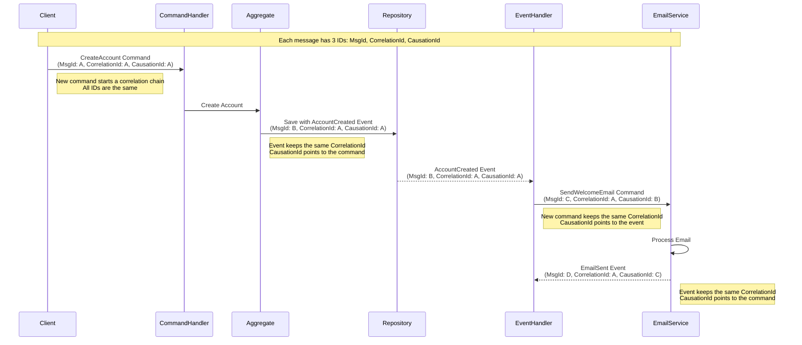

# Correlation and Causation Tracking Diagram

This diagram illustrates how correlation and causation IDs are propagated through a message chain in Reactive Domain.

## Message Flow with Correlation and Causation IDs



## Explanation

### Message IDs

Each message in Reactive Domain has three important identifiers:

1. **MsgId**: A unique identifier for the message itself
2. **CorrelationId**: An identifier that groups related messages together
3. **CausationId**: The identifier of the message that directly caused this message

### Correlation Chain

In the diagram above:

- All messages share the same **CorrelationId** (A), indicating they are part of the same business transaction
- Each message's **CausationId** points to the **MsgId** of the message that caused it, creating a chain of causality
- This chain allows for complete tracing of the transaction from initiation to completion

### Implementation with MessageBuilder

The recommended way to create correlated messages is to use the `MessageBuilder` factory:

```csharp
// Create a new message that starts a correlation chain
var createCommand = MessageBuilder.New(() => new CreateAccount(accountId));

// Create an event from the command (maintains correlation)
var createdEvent = MessageBuilder.From(createCommand, () => 
    new AccountCreated(accountId, "ACC-123", "John Doe"));

// Create another command from the event (maintains correlation)
var sendEmailCommand = MessageBuilder.From(createdEvent, () => 
    new SendWelcomeEmail(accountId, "john.doe@example.com"));
```

## Benefits

- **Debugging**: Easily trace related messages across system boundaries
- **Auditing**: Track the complete flow of a business transaction
- **Monitoring**: Group related operations for performance analysis
- **Error Handling**: Understand the context in which errors occur
