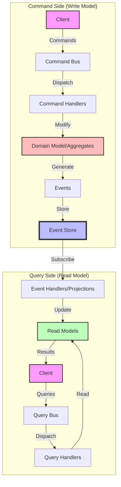
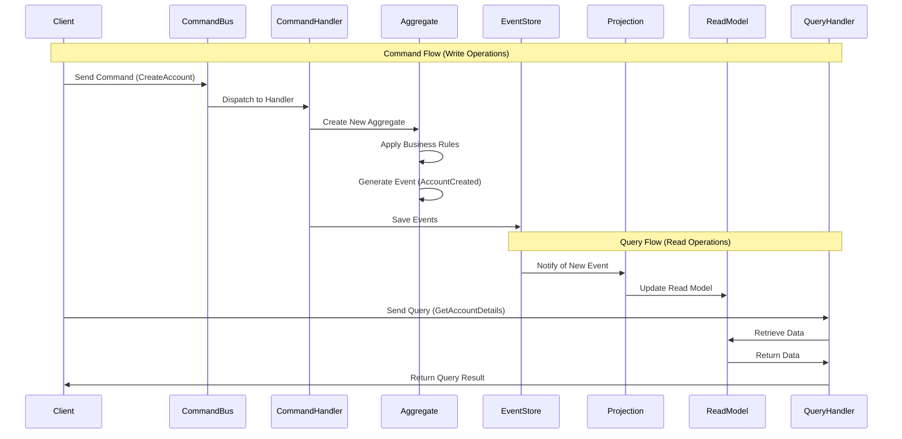

# CQRS Architecture Diagram

This diagram illustrates the Command Query Responsibility Segregation (CQRS) pattern as implemented in Reactive Domain.

## CQRS Overview

## Detailed CQRS Implementation

## Key Components

### Command Side (Write Model)

- **Commands**: Represent intentions to change the system state
- **Command Bus**: Routes commands to appropriate handlers
- **Command Handlers**: Process commands and coordinate with aggregates
- **Domain Model/Aggregates**: Encapsulate business rules and state changes
- **Events**: Represent facts that have occurred in the system
- **Event Store**: Persists events as the source of truth

### Query Side (Read Model)

- **Event Handlers/Projections**: Transform events into read models
- **Read Models**: Optimized for querying and reporting
- **Queries**: Requests for information from the system
- **Query Bus**: Routes queries to appropriate handlers
- **Query Handlers**: Process queries against read models

## Benefits of CQRS in Reactive Domain

- **Separation of Concerns**: Write and read operations are handled separately
- **Scalability**: Read and write sides can be scaled independently
- **Optimization**: Read models can be optimized for specific query patterns
- **Flexibility**: Multiple read models can be created from the same events
- **Performance**: Read operations don't block write operations and vice versa

## Implementation in Reactive Domain

Reactive Domain provides infrastructure for implementing CQRS:

- **Command and Event Base Classes**: Provide structure for messages
- **Repository Pattern**: Abstracts event storage and retrieval
- **MessageBus**: Routes commands and events to handlers
- **ReadModelBase**: Base class for creating read models
- **Projection Framework**: Tools for transforming events into read models
