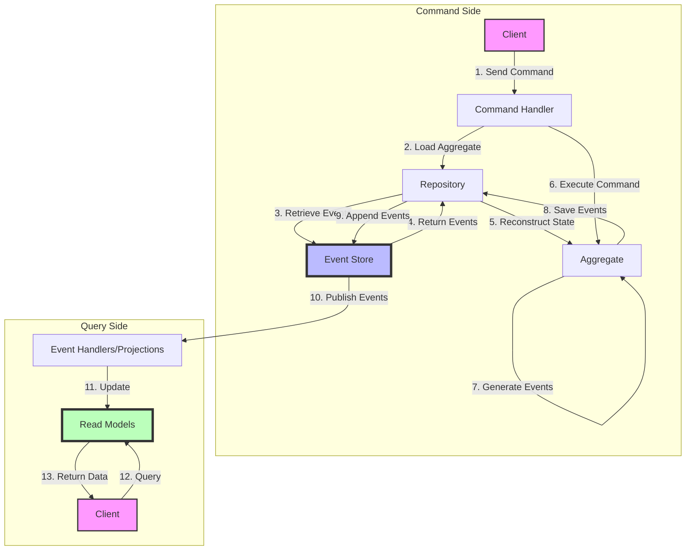
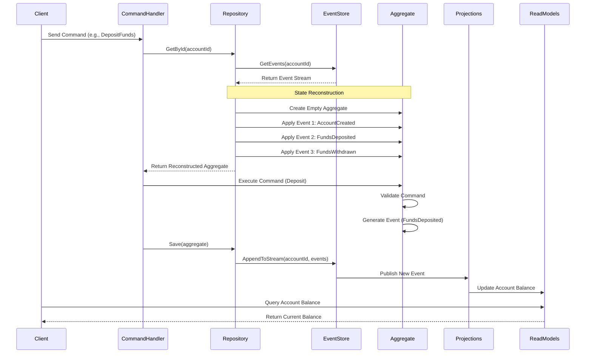

# Event Sourcing Flow Diagram

This diagram illustrates the core flow of events in an event-sourced system using Reactive Domain.

## Basic Event Sourcing Flow

## Detailed Event Flow with State Reconstruction

## Key Concepts Illustrated

### Event Storage and Retrieval

- Events are the primary source of truth in the system
- All state changes are recorded as immutable events
- The event store maintains the complete history of all events

### State Reconstruction

- Aggregates don't store state directly
- State is reconstructed by replaying events in sequence
- Each event is applied to the aggregate to update its state

### Command Processing

1. Commands are received from clients
2. The appropriate aggregate is loaded from its event history
3. The command is executed on the aggregate
4. New events are generated to represent state changes
5. The events are saved to the event store

### Projections and Read Models

- Events are published to projections
- Projections transform events into read-optimized models
- Clients query read models for information
- Multiple read models can be built from the same events

## Benefits of Event Sourcing

- **Complete Audit Trail**: Every change is recorded as an event
- **Temporal Queries**: Ability to determine state at any point in time
- **Separation of Concerns**: Clear separation between write and read operations
- **Event Replay**: Ability to rebuild state or create new projections from existing events
