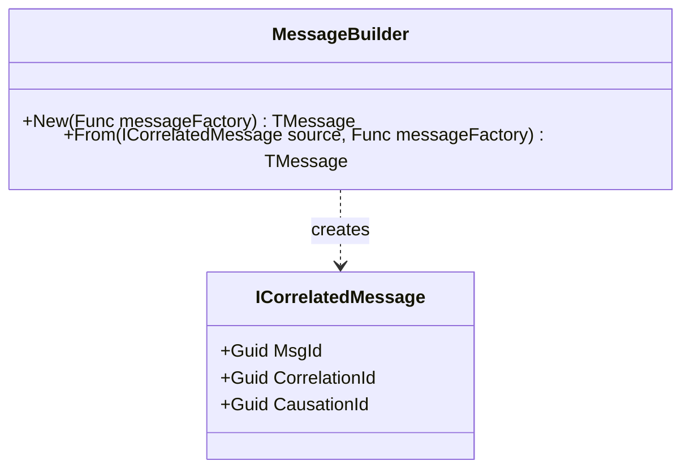
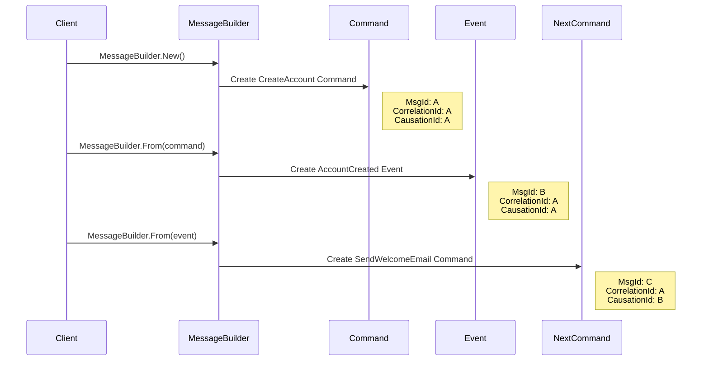

# MessageBuilder Usage Diagram

This diagram illustrates how the `MessageBuilder` factory creates correlated messages in Reactive Domain, showing the flow of correlation and causation IDs.

## MessageBuilder Methods Overview



## MessageBuilder.New() Flow

```mermaid
flowchart TD
    A[MessageBuilder.New()] -->|1. Call Factory| B[Message Factory]
    B -->|2. Create Message| C[New Message]
    C -->|3. Generate MsgId| D[Guid.NewGuid()]
    C -->|4. Set CorrelationId = MsgId| C
    C -->|5. Set CausationId = MsgId| C
    C -->|6. Return Message| E[Correlated Message]
    
    style C fill:#bbf,stroke:#333,stroke-width:2px
```

## MessageBuilder.From() Flow

```mermaid
flowchart TD
    A[MessageBuilder.From()] -->|1. Get Source IDs| B[Source Message]
    A -->|2. Call Factory| C[Message Factory]
    C -->|3. Create Message| D[New Message]
    D -->|4. Generate MsgId| E[Guid.NewGuid()]
    B -->|5. Copy CorrelationId| D
    B -->|6. Set CausationId = Source.MsgId| D
    D -->|7. Return Message| F[Correlated Message]
    
    style B fill:#fbb,stroke:#333,stroke-width:2px
    style D fill:#bbf,stroke:#333,stroke-width:2px
```

## Message Chain Creation Example



## Code Examples

### Starting a New Correlation Chain

```csharp
// Create a new command that starts a correlation chain
var createCommand = MessageBuilder.New(() => new CreateAccount(
    Guid.NewGuid(),
    "John Doe",
    "john.doe@example.com"
));

// Result:
// createCommand.MsgId = new Guid (e.g., "A")
// createCommand.CorrelationId = same as MsgId ("A")
// createCommand.CausationId = same as MsgId ("A")
```

### Continuing a Correlation Chain

```csharp
// Create an event from a command (maintains correlation)
var createdEvent = MessageBuilder.From(createCommand, () => new AccountCreated(
    ((CreateAccount)createCommand).AccountId,
    "ACC-123",
    "John Doe"
));

// Result:
// createdEvent.MsgId = new Guid (e.g., "B")
// createdEvent.CorrelationId = createCommand.CorrelationId ("A")
// createdEvent.CausationId = createCommand.MsgId ("A")

// Create another command from the event (maintains correlation)
var sendEmailCommand = MessageBuilder.From(createdEvent, () => new SendWelcomeEmail(
    ((AccountCreated)createdEvent).AccountId,
    "john.doe@example.com"
));

// Result:
// sendEmailCommand.MsgId = new Guid (e.g., "C")
// sendEmailCommand.CorrelationId = createdEvent.CorrelationId ("A")
// sendEmailCommand.CausationId = createdEvent.MsgId ("B")
```

## Key Benefits

### Automatic Correlation

- Correlation IDs are automatically maintained across message chains
- No need to manually track and pass correlation information

### Causation Tracking

- Each message knows which message caused it
- Creates a complete chain of causality for debugging and auditing

### Simplified API

- Factory methods handle all the complexity of correlation
- Developers can focus on the business logic of messages

### Consistent Implementation

- Ensures all messages follow the same correlation pattern
- Prevents errors from manual correlation management
