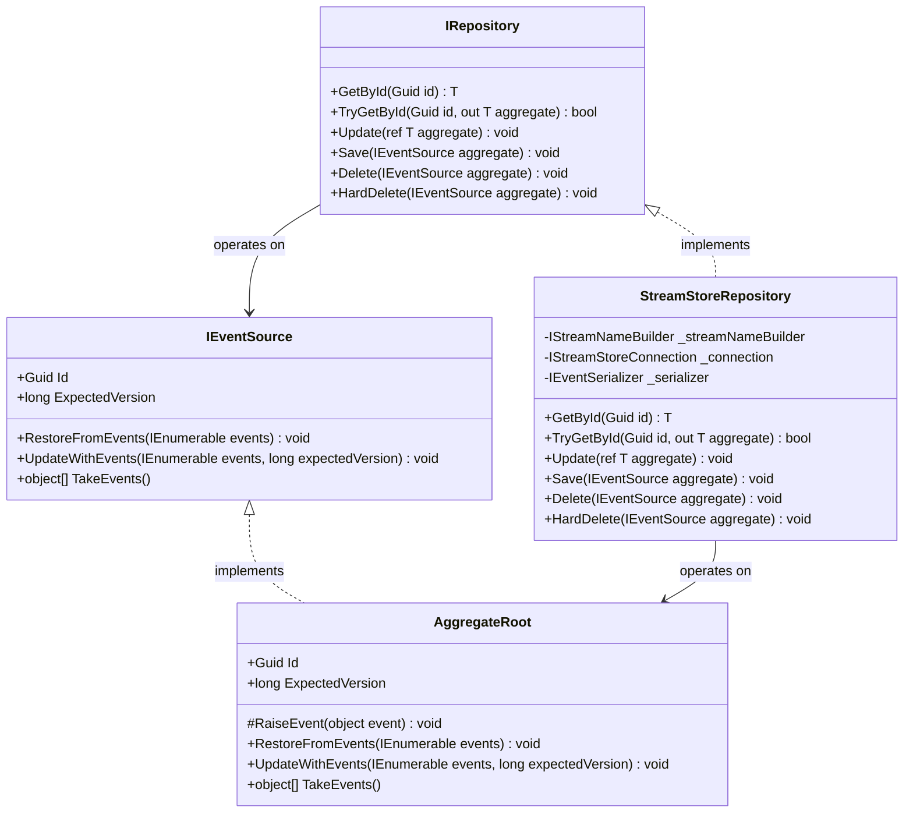
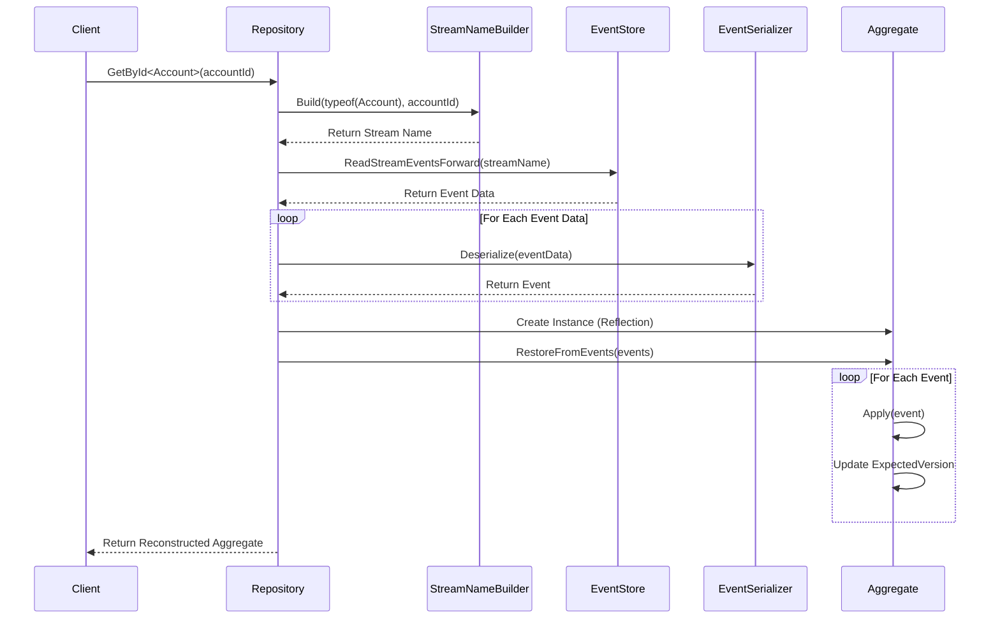
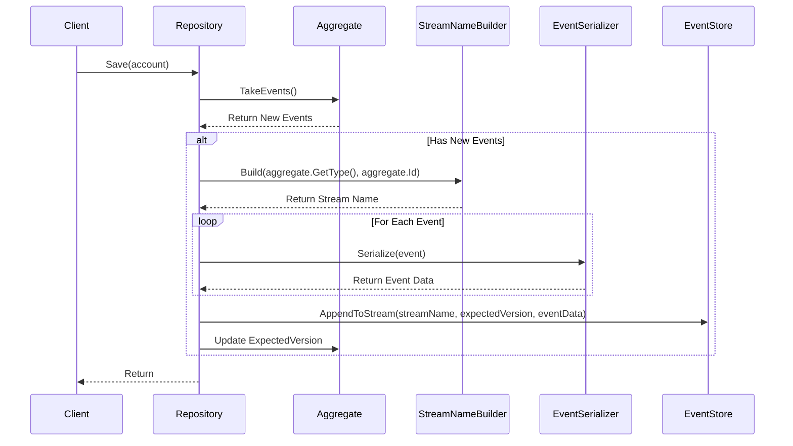
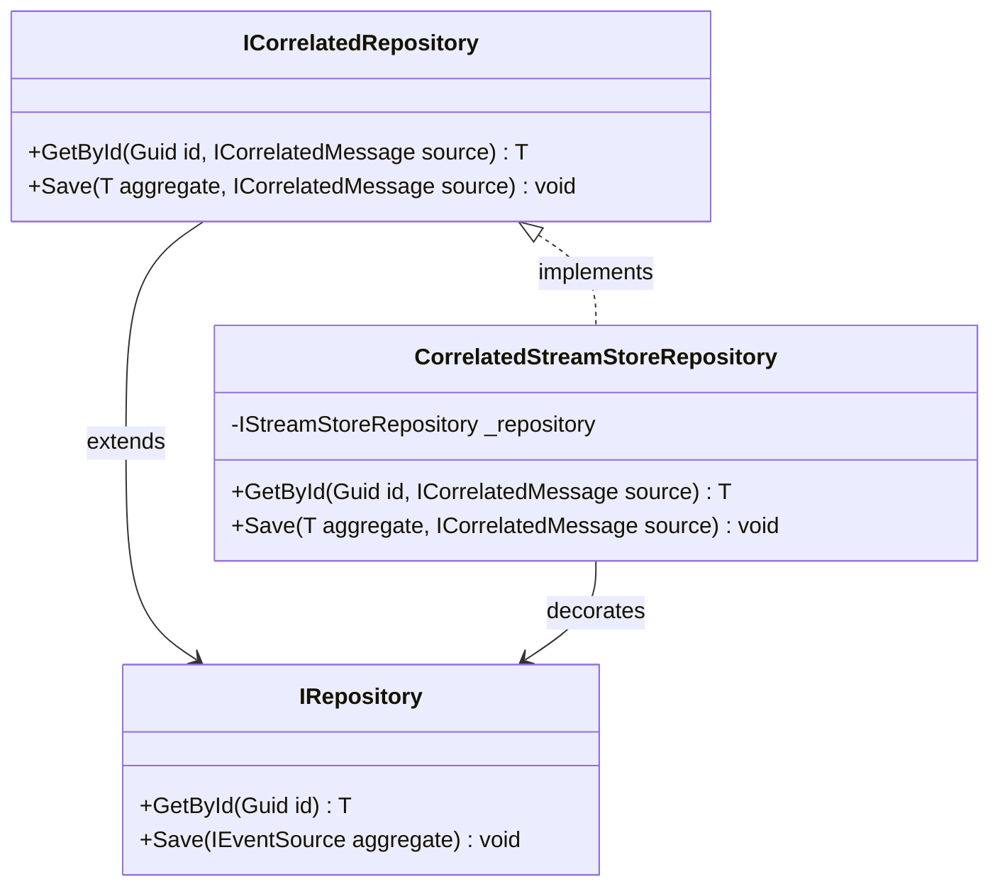

# Repository Pattern Diagram

This diagram illustrates how repositories interact with aggregates and the event store in Reactive Domain.

## Repository Pattern Overview



## Repository Operations Flow

```mermaid
flowchart TD
    subgraph "GetById Operation"
        A1[Repository.GetById] -->|1. Generate Stream Name| B1[Stream Name Builder]
        B1 -->|2. Get Events| C1[Event Store]
        C1 -->|3. Return Events| D1[Events]
        D1 -->|4. Create Aggregate| E1[Aggregate Constructor]
        E1 -->|5. Restore From Events| F1[Aggregate]
        F1 -->|6. Return Aggregate| G1[Client]
    end
    
    subgraph "Save Operation"
        A2[Repository.Save] -->|1. Take Events| B2[Aggregate.TakeEvents]
        B2 -->|2. Return New Events| C2[Events]
        A2 -->|3. Generate Stream Name| D2[Stream Name Builder]
        D2 -->|4. Append To Stream| E2[Event Store]
        A2 -->|5. Update Expected Version| F2[Aggregate]
    end
    
    subgraph "Delete Operation"
        A3[Repository.Delete] -->|1. Create Delete Event| B3[Delete Event]
        A3 -->|2. Append Delete Event| C3[Event Store]
    end
    
    subgraph "HardDelete Operation"
        A4[Repository.HardDelete] -->|1. Generate Stream Name| B4[Stream Name Builder]
        B4 -->|2. Delete Stream| C4[Event Store]
    end
```



## Detailed Repository Operations

### GetById Operation



### Save Operation



## Correlated Repository Extension



## Implementation Example

```csharp
// Creating a repository
var streamNameBuilder = new PrefixedCamelCaseStreamNameBuilder("MyApp");
var connection = new StreamStoreConnection(connectionSettings, "localhost", 1113);
var serializer = new JsonMessageSerializer();
var repository = new StreamStoreRepository(streamNameBuilder, connection, serializer);

// Using the repository
try {
    // Load an aggregate
    var account = repository.GetById<Account>(accountId);
    
    // Modify the aggregate
    account.Deposit(100);
    
    // Save the aggregate
    repository.Save(account);
    
    // Delete the aggregate (soft delete)
    repository.Delete(account);
    
    // Hard delete the aggregate (permanent deletion)
    repository.HardDelete(account);
}
catch (AggregateNotFoundException ex) {
    // Handle not found
}
catch (AggregateDeletedException ex) {
    // Handle deleted
}
catch (AggregateVersionException ex) {
    // Handle concurrency conflict
}
```

## Key Concepts

### Repository Abstraction

- Repositories abstract the details of event storage and retrieval
- They provide a collection-like interface for working with aggregates
- They handle the complexities of event sourcing infrastructure

### Optimistic Concurrency

- `ExpectedVersion` is used to detect concurrent modifications
- Version conflicts throw `AggregateVersionException`
- This ensures data consistency without locking

### Aggregate Lifecycle Management

- Repositories handle the complete lifecycle of aggregates
- Creation, loading, updating, and deletion operations
- Both soft delete (logical) and hard delete (physical) options

### Event Serialization

- Events are serialized for storage and deserialized for loading
- The serialization format is abstracted through the `IEventSerializer` interface
- This allows for different serialization strategies (JSON, Protocol Buffers, etc.)
