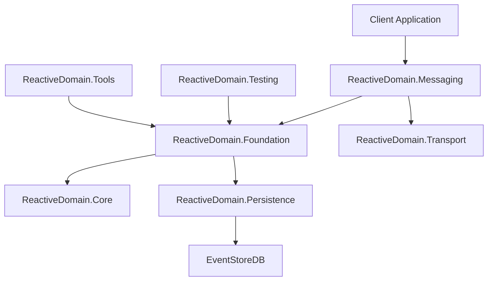

# Reactive Domain Overview

## Introduction

Reactive Domain is an open-source framework for implementing event sourcing in .NET projects using reactive programming principles. It provides a comprehensive set of tools and patterns for building event-sourced applications with a focus on domain-driven design (DDD) and Command Query Responsibility Segregation (CQRS).

The framework integrates with [EventStoreDB](https://eventstore.com) to provide robust event storage and retrieval capabilities, while also offering a messaging framework and other utilities for implementing CQRS effectively.

## Philosophy and Design Principles

Reactive Domain is built on several key design principles:

1. **Simplicity and Consistency**: The framework emphasizes a small number of consistent patterns and design principles in its public interfaces, making it easier for developers to learn and use.

2. **Developer Experience**: Ease of use and "design for code review" have been the driving forces behind the framework's evolution. The API is designed to be intuitive and self-documenting.

3. **Opinionated Design**: The framework makes opinionated choices about implementation details to provide a clear path for developers to follow.

4. **Pragmatic Trade-offs**: Where trade-offs have been necessary, the framework prioritizes developer experience and code clarity over performance optimizations.

## Key Features

Reactive Domain offers a rich set of features for building event-sourced applications:

- **Event Sourcing**: A complete implementation of event sourcing patterns, including aggregates, events, and repositories.
- **CQRS Support**: Tools for implementing Command Query Responsibility Segregation, including command handlers and projections.
- **EventStoreDB Integration**: Built-in support for storing and retrieving events using EventStoreDB.
- **Messaging Framework**: A comprehensive messaging system for handling commands, events, and queries.
- **Testing Utilities**: Tools for testing event-sourced applications, including in-memory event stores and test fixtures.
- **Correlation and Causation Tracking**: Built-in support for tracking correlation and causation IDs across message flows.
- **Snapshotting**: Support for creating and restoring from snapshots to improve performance.

## Architecture Overview

Reactive Domain is organized into several key components:

- **ReactiveDomain.Core**: Contains the fundamental interfaces and abstractions.
- **ReactiveDomain.Foundation**: Implements the domain layer, including aggregates and repositories.
- **ReactiveDomain.Messaging**: Provides the messaging framework for commands, events, and queries.
- **ReactiveDomain.Persistence**: Handles event storage and retrieval.
- **ReactiveDomain.Transport**: Manages message transport between components.
- **ReactiveDomain.Testing**: Offers utilities for testing event-sourced applications.
- **ReactiveDomain.Tools**: Provides additional tools and utilities.

## When to Use Reactive Domain

Reactive Domain is particularly well-suited for:

- Complex business domains with rich behavior
- Applications requiring a complete audit trail of all changes
- Systems with complex business rules and validations
- Applications needing high scalability for read operations
- Projects where team alignment around DDD principles is important

## Getting Started

To get started with Reactive Domain, see the [Core Concepts](core-concepts.md) section for an introduction to the fundamental principles, and the [Usage Patterns](usage-patterns.md) section for practical guidance on using the framework.

For code examples, see the [Code Examples](code-examples/README.md) section.
